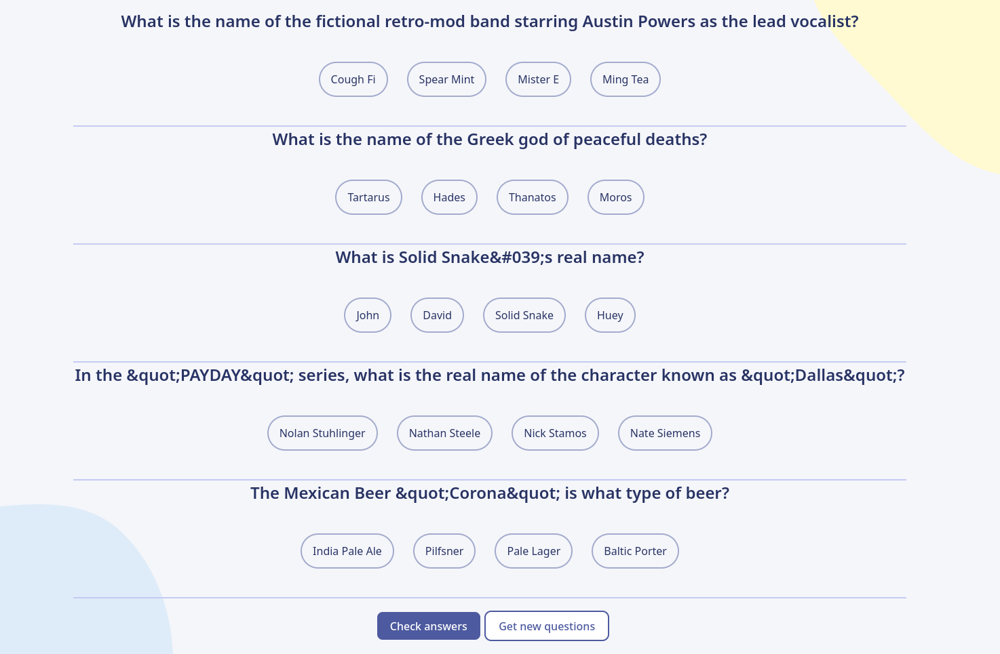
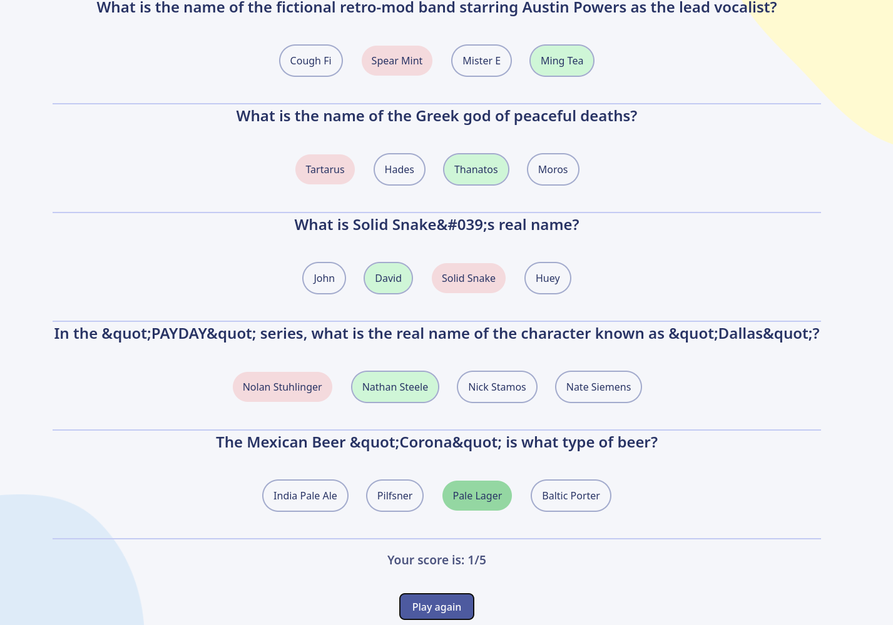

# Scrimba Quizzical Clone




## About

It is a web app, created in September 2024 using React (Javascript) to learn
this beautiful UI library. Credits to
[Scrimba](https://scrimba.com/learn-react-c0e) to teach me React.

This is a SPA that loads questions from the
[Open Trivia Database](https://opentdb.com/) REST API. Every question has
several answers and the user should choose the right one. If the answer is
wrong, then the user can see the right one and its score after completing the
quiz.

## How to run

```sh
# Navigate to the project's folder
npm ci
npm run dev
```

## TODO

- [ ] Add menu selection for Categories like Animals, Art...
- [ ] Improve the UX by making the "Get new questions" more responsive
